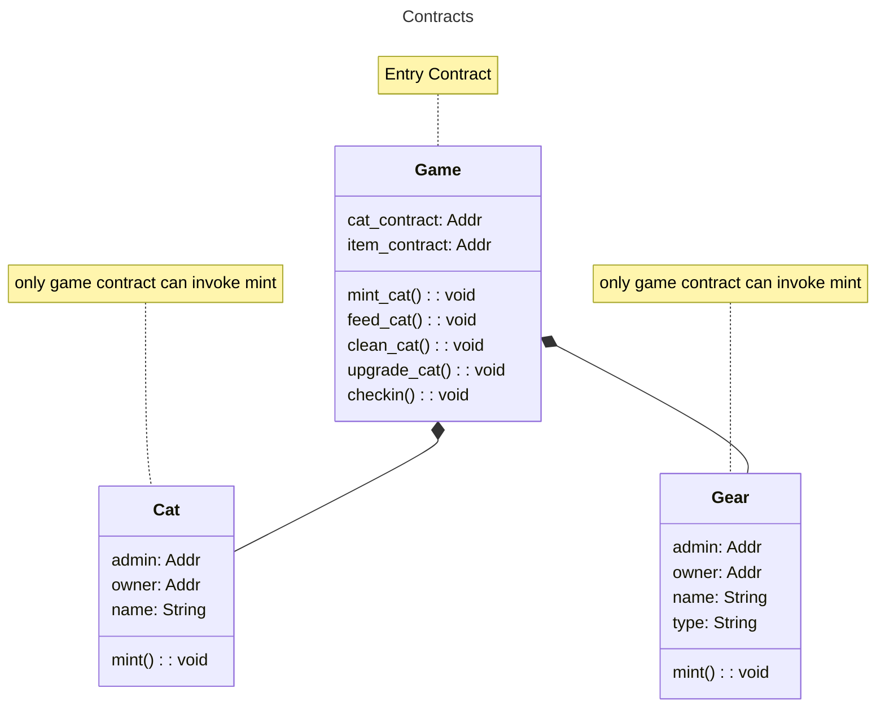
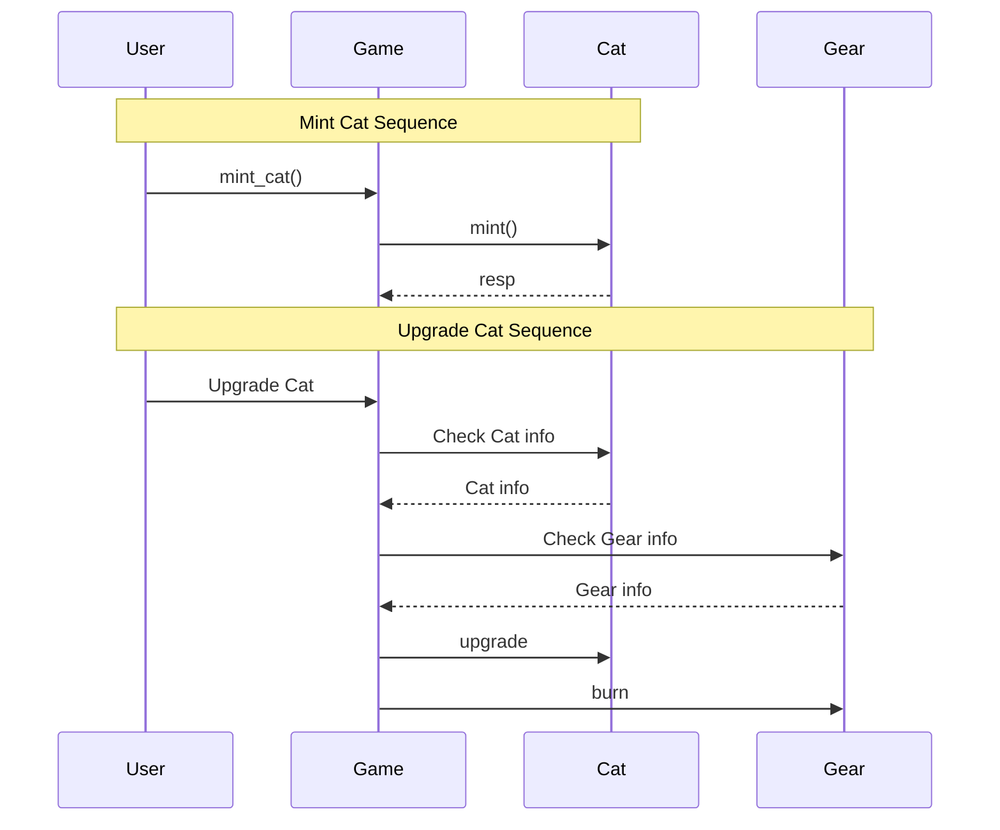

## CootCat Game

### Design

##### Contracts


```mermaid
---
title: Contracts
---
classDiagram
  note for Game "Entry Contract"
  note for Cat "only game contract can invoke mint"
  note for Gear "only game contract can invoke mint"

  Game *-- Cat
  Game *-- Gear

  class Game {
    cat_contract: Addr
    item_contract: Addr

    mint_cat(): void
    feed_cat(): void
    clean_cat(): void
    upgrade_cat(): void
    checkin(): void
  }

  class Cat {
    admin: Addr
    owner: Addr
    name: String
    mint(): void
  }

  class Gear {
    admin: Addr
    owner: Addr
    name: String
    type: String
    mint(): void
  }
```

##### Sequence Diagram


```mermaid
sequenceDiagram
  participant User
  participant Game
  participant Cat
  participant Gear

  Note over User,Cat: Mint Cat Sequence
  User ->> Game: mint_cat()
  Game ->> Cat: mint()
  Cat -->> Game: resp

  Note over User,Gear: Upgrade Cat Sequence
  User ->> Game: Upgrade Cat
  Game ->> Cat: Check Cat info
  Cat -->> Game: Cat info
  Game ->> Gear: Check Gear info
  Gear -->> Game: Gear info
  Game ->> Cat: upgrade
  Game ->> Gear: burn


```

```

```
